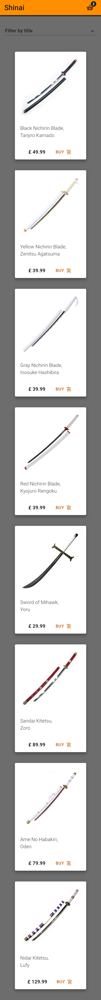

# Anime Swords Shop - Project #3

## Table of contents

- [Overview](#overview)
  - [The challenge](#the-challenge)
  - [Screenshot](#screenshot)
  - [Links](#links)
- [My process](#my-process)
  - [Built with](#built-with)
  - [Useful resources](#useful-resources)
  - [Credits](#credits)

## Overview

### The challenge

Users should be able to:

- View the optimal layout for each page depending on their device's screen size.
- See hover states for all interactive elements on the page.
- Add items to cart.
- Remove an item from the cart as well as increase or decrement items.

### Screenshot

### Links

- Live Site URL: [https://anime-swords-shop.herokuapp.com/](https://anime-swords-shop.herokuapp.com/)

## My process

### Built with

- Flexbox
- Grid
- Mobile first workflow
- JSS
- [React](https://reactjs.org/)
- [Material-UI](https://material-ui.com/)

### Credits

- [Swords Images](https://www.otakuninjahero.com/)
- [Transparent Image](pngaaa.com/)
